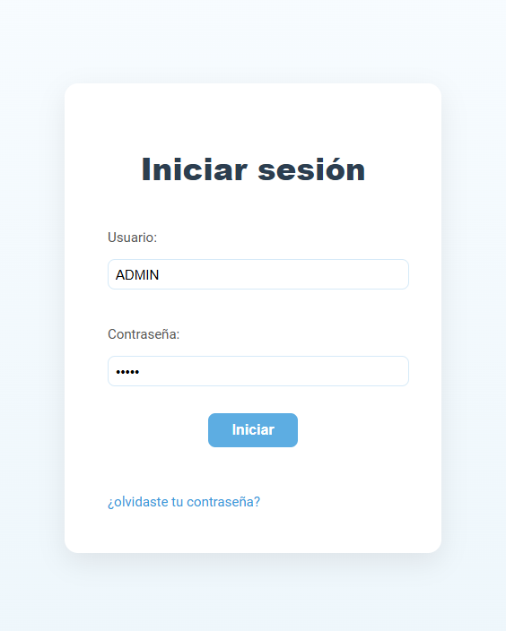
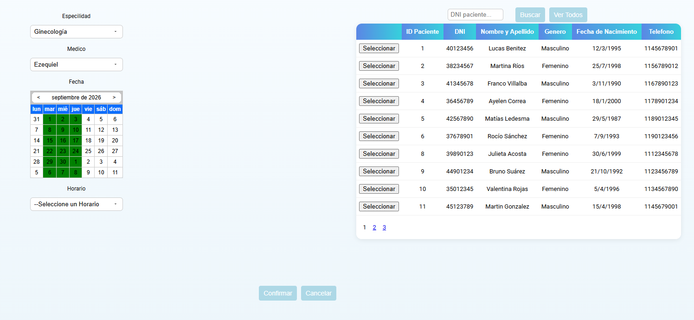
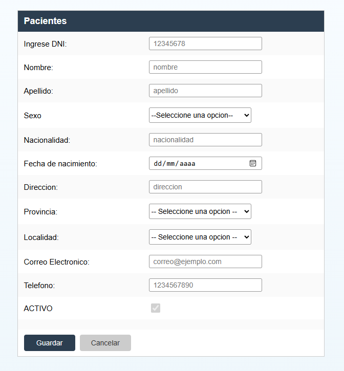
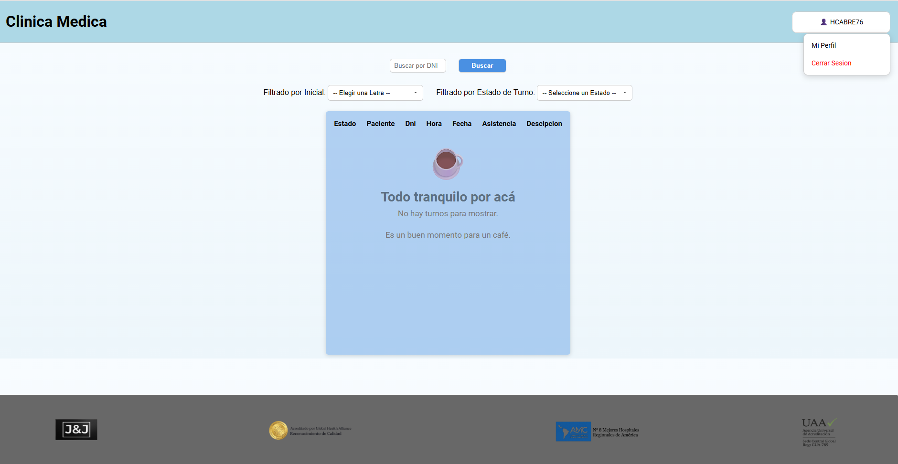

# 🏥 Sistema de Gestión Clínica (ASP.NET Web Forms)

Sistema web monolítico desarrollado en **C# con ASP.NET Web Forms (.NET Framework)** y **Microsoft SQL Server** para la administración clínica: asignación de turnos, agendas de profesionales médicos y padrón de pacientes.

Proyecto desarrollado de forma colaborativa enfocado en la aplicación de arquitectura en capas, persistencia relacional con **ADO.NET** y lógica transaccional mediante procedimientos almacenados y triggers.

---

## 📸 Capturas del Sistema

> *Las siguientes capturas muestran el funcionamiento del sistema en sus módulos principales:*

| Inicio de Sesión / Login | Gestión de Turnos |
| :---: | :---: |
|  |  |

| Administración de Pacientes | Agenda y Médicos |
| :---: | :---: |
|  |  |

---

## 📌 Tabla de Contenidos
- [Características Principales](#-características-principales)
- [Arquitectura del Sistema](#-arquitectura-del-sistema)
- [Base de Datos y Modelo Relacional](#-base-de-datos-y-modelo-relacional)
- [Tecnologías Utilizadas](#-tecnologías-utilizadas)
- [Instalación y Configuración](#-instalación-y-configuración)
- [Decisiones de Diseño y Próximas Mejoras](#-decisiones-de-diseño-y-próximas-mejoras)
- [Autores](#-autores)

---

## 🚀 Características Principales

* **Seguridad y Acceso:**
  * Login con autenticación de usuarios y roles. El sistema diferencia entre perfil **Administrador** (recepción/gestión total) y perfil **Médico** (gestión de su propia agenda).
* **Gestión de Turnos Médicos:**
  * Asignación y cancelación de turnos por parte del administrador.
  * Control de estados de cita (*Pendiente*, *Atendido*, *Cancelado*).
  * Validación de disponibilidad de agenda y franjas horarias por profesional.
  * Historial: Cada médico puede visualizar exclusivamente los turnos que le fueron asignados.
* **Módulo de Profesionales y Especialidades:**
  * Alta, baja lógica y modificación de médicos.
  * Asignación de especialidad (un médico pertenece a una única especialidad clínica).
  * Configuración de días y franjas horarias de atención.
* **Administración de Pacientes:**
  * Registro clínico con datos personales y domicilio normalizado (Localidades y Provincias).
* **Interfaz Dinámica de Servidor:**
  * Páginas `.aspx` estructuradas con *Master Pages* para un diseño unificado.
  * Controles de servidor (`GridView`, `DropDownList`, validadores) vinculados al ciclo de vida de la página.

---

## 🏗 Arquitectura del Sistema

El proyecto implementa una separación por capas para desacoplar las reglas de negocio y el acceso a datos de la interfaz de usuario:

$$\text{Capa Web (ASPX / UI)} \longrightarrow \text{Capa de Negocio (BLL)} \longrightarrow \text{Capa de Datos (DAL / ADO.NET)} \longrightarrow \text{SQL Server}$$

```
PROYECTO-CLINICA/
├── Vistas/ (.aspx)        # Formularios web, vistas de usuario y Master Pages
│   └── Code-behind (.cs)  # Manejo de eventos del servidor y enlace de controles
├── Negocio/               # Lógica de aplicación, validaciones y reglas clínicas
├── Datos/                 # Persistencia mediante ADO.NET (AccesoDatos, SqlCommand, SqlDataReader)
├── Entidades/             # Clases POCO que representan los objetos del negocio
└── DB/ (Scripts)          # Scripts DDL/DML de la base de datos CLINICA_MEDICA
```

---

## 🗄 Base de Datos y Modelo Relacional
Persistencia desarrollada en Microsoft SQL Server, utilizando integridad referencial, procedimientos almacenados para operaciones críticas y triggers de control.

**Tablas Principales**
*Medicos: Legajo, matrícula, datos personales y estado activo/inactivo.*

*Pacientes: Padrón de pacientes con datos de contacto.*

*Turnos: Tabla transaccional central.*

*Especialidades: Catálogo de disciplinas médicas.*

*Horarios: Días y franjas de atención asignados a cada profesional.*

*Localidades y Provincias: Normalización geográfica para domicilios.*

*Usuarios: Control de credenciales y roles (Admin/Médico).*

*Estados: Catálogo para manejar el ciclo de vida del turno (Pendiente, Atendido, Cancelado).*

**Objetos de Base de Datos**
Procedimientos Almacenados (Stored Procedures): Centralización de consultas, ABM (Altas, Bajas, Modificaciones) y filtros para evitar inyección SQL y optimizar el rendimiento.

Triggers: Utilizados para automatizar controles de estado y auditoría interna.

---

## 🛠 Tecnologías Utilizadas
Lenguaje: `C#`

Entorno Web: `ASP.NET Web Forms`

Acceso a Datos: `ADO.NET`

Base de Datos: `Microsoft SQL Server`

Entorno de Desarrollo: `Visual Studio / SQL Server Management Studio`

---

## ⚙️ Instalación y Configuración
*Clonar el repositorio:*

*Bash*
git clone [https://github.com/JoseZenteno269/PROYECTO-CLINICA.git](https://github.com/JoseZenteno269/PROYECTO-CLINICA.git)

* Restaurar la Base de Datos:

  * Abrir SQL Server Management Studio (SSMS).

  * Ejecutar el script SQL incluido en el proyecto (CLINICA_MEDICA.sql) para generar la estructura y los procedimientos almacenados.

Configurar la Conexión:

Abrir el archivo Web.config y ajustar la cadena de conexión según tu entorno local:
```
<connectionStrings>
  <add name="ClinicaDB" 
       connectionString="data source=.;initial catalog=CLINICA_MEDICA;integrated security=True;" 
       providerName="System.Data.SqlClient" />
</connectionStrings>
```
    
Compilar y Ejecutar:

Abrir la solución .sln en Visual Studio y ejecutar mediante IIS Express (F5).

---

## 💡 Decisiones de Diseño y Próximas Mejoras (Roadmap)
Como parte de mi aprendizaje continuo, al auditar este proyecto universitario identifiqué oportunidades de mejora arquitectónica que planeo implementar en futuras versiones:

Deuda Técnica y Normalización:

En esta versión inicial, Medicos y Pacientes repiten campos de información personal. La mejora proyectada es implementar una tabla/clase base Persona para abstraer los datos comunes y mejorar la normalización de la base de datos y la herencia en el código.

Evolución de la Arquitectura:

Migrar el sistema monolítico actual (Web Forms) a una arquitectura de API REST utilizando ASP.NET Core Web API o Node.js/Python, separando completamente el Backend del Frontend (implementado con HTML5, CSS3 y JavaScript nativo).

## 👥 Autores
José Zenteno

Backend Developer en formación

Jeremías Tortora

Desarrollador / Estudiante UTN
